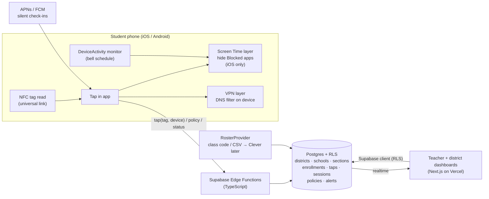

# Architecture — the system in plain English

Owner: tech-lead chat. Version: v01 (2026-08-25). Change this doc before changing the system.

## The one-paragraph version

A student's phone reads an NFC tag at the classroom door. The tag's URL opens the Tap in app, which sends "device X read tag Y at 8:56" to the server. The server (Supabase) knows tag Y is Room 214 and that Room 214 has Biology P2 from 9:00 to 9:50, records the attendance, and answers "you're in Biology P2; class mode until 9:50; here is today's policy." The phone then hides the Blocked apps (Screen Time) and starts filtering the internet (VPN) until 9:50, when both lift automatically. The teacher's dashboard reads the same database and shows who tapped, who's locked, and who bypassed. The district dashboard aggregates across schools.

## Diagram

## The pieces

### 1. Supabase backend
- **Postgres** holds everything (see `data-model.md`). **Row Level Security** enforces "a teacher sees only her sections; a student sees only themself; a district admin sees their district." The dashboards talk to the database directly through the Supabase client, so the permission rules live in one place.
- **Auth** — Supabase Auth. Teachers/admins: email magic link (SSO later). Students: no email login — a device-bound account created at class-code join (see `security.md`).
- **Edge Functions** (TypeScript, Deno) for anything that must not be trusted to the client: `tap` (verify the tag, resolve the section, create the attendance + lock session, return the policy), `join` (class code → enrollment + device registration), `status` (bypass signals), `policy` (compile Blocked/Approved lists into bundle IDs + domains), `unlock` (teacher lifts class mode), later `roster-sync`.
- **Two projects:** `tapin-dev` now; `tapin-pilot` in October (real students; treated as production).

### 2. iOS app (Swift / SwiftUI)
Three targets:
- **App** — onboarding (class code → Screen Time permission → VPN permission), Today / Schedule / Profile (as in the `_v05` demo), tag handling, status reporting.
- **DeviceActivityMonitor extension** — Apple wakes it at the start and end of each scheduled interval (the bell schedule); it applies and clears the Screen Time block even if the app isn't running.
- **Packet Tunnel extension** — the VPN: captures DNS queries, answers "blocked" for domains on the list, forwards everything else to a real resolver. Split-tunnel: only DNS enters the tunnel; all other traffic goes direct, so battery and speed are unaffected. When the student turns it off, iOS calls the extension's stop handler, which reports `vpn_off` before it exits.

Details, constraints and fallbacks: `ios.md`.

### 3. Android app (Kotlin) — after iOS
Tap (NFC intent) → `tap` function → attendance → persistent notification "Class mode until 9:50" → the same DNS-filtering VPN via `VpnService`. No Screen Time equivalent; the teacher dashboard shows "Android — network block only."

### 4. Dashboards (Next.js)
One web app, two roles. Built to the `_v05` demos: teacher (Dashboard / Reports / Settings), district (Dashboard / school drill-ins / SIS / Settings). Reads via the Supabase client with RLS; live updates via Supabase Realtime on `taps`, `lock_sessions`, `alerts`. The Blocked/Approved app list is a district Settings page (new).

### 5. Rostering
`RosterProvider` interface: `importSection(...)`, `listEnrollments(...)`, `reconcile(...)`. Providers: `ClassCodeCsvProvider` (v1), `CleverProvider` (later, against Clever's sandbox), `GenesisProvider` (phase two, attendance write-back). See `roster-and-clever.md`.

### 6. Tags
Dev + mock school: NTAG215 stickers written with a URL like `https://t.tapinschools.com/t/<tag_id>`. Pilot: NTAG 424 DNA with SUN/SDM — the URL carries a changing, signed code; the `tap` function verifies it with the tag's key (server-side only) and rejects replays.

## Core flows

**Join (once):** student installs the app → enters the class code from the teacher → `join` creates the student (if new), enrollment, and device record; returns a device token (stored in Keychain) → app asks for Screen Time access → app asks to install the VPN configuration → done.

**Tap (every class):** NFC read → universal link opens the app → `tap(tag_id, sdm_code?, device_token, client_time)` → server resolves section + bell → inserts `tap` + `lock_session` → returns `{section, ends_at, policy_version}` → app schedules the DeviceActivity interval to `ends_at` and applies the block; VPN already running, list refreshed if `policy_version` changed → at `ends_at` the monitor extension clears the block.

**Bypass:** VPN stopped → extension posts `status(vpn_off)` → `alerts` row → teacher dashboard (realtime). Screen Time revoked → detected at the next tap or at the silent push check-in at period start → `status(screentime_revoked)` → alert. Re-enabled → alert resolved.

**Teacher unlock:** dashboard → `unlock(section_id)` → `lock_sessions` marked `unlocked_by_teacher` → silent push to enrolled devices → app clears the block and pauses the VPN filter until the next tap or bell.

## What is deliberately not here (yet)
Clever OAuth/SSO, SIS write-back, Android Screen-Time-equivalent, guardian access, ID cards for no-phone students (teacher marks by hand), analytics beyond counts, AI features.

## Principles
Modular monolith on Supabase; permission rules in the database; untrusted clients; secrets only on the server; every external system behind an interface; small commits; docs change before code.
